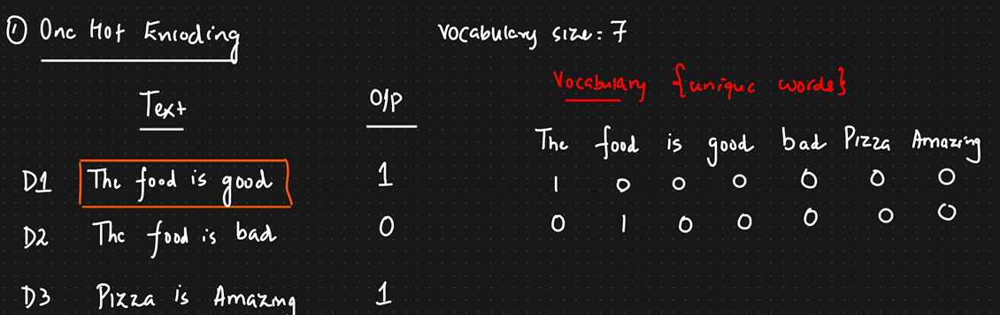
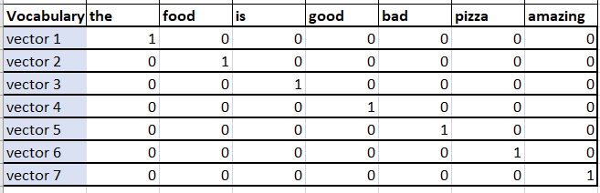
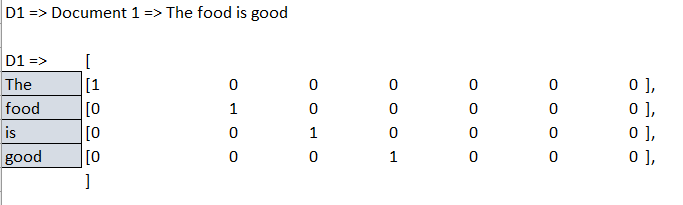
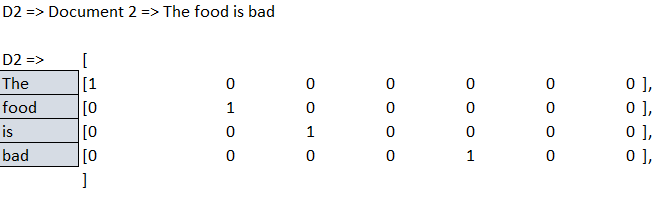
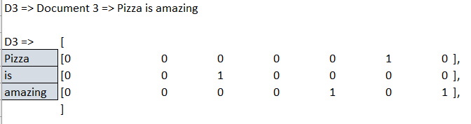
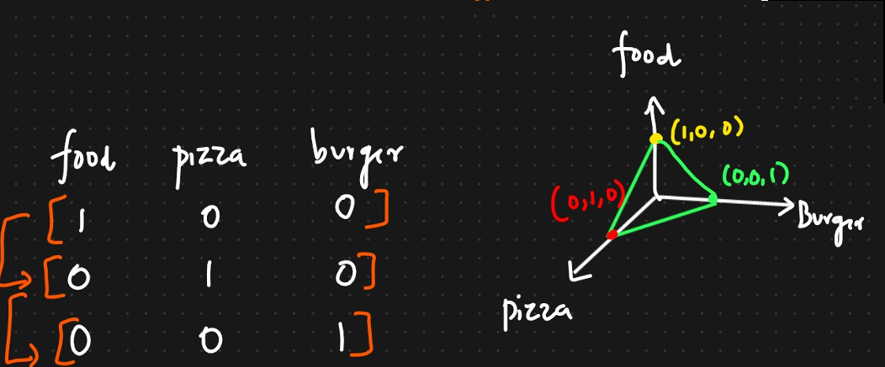
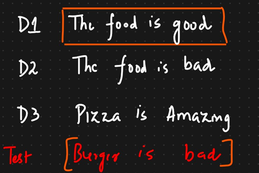

# One Hot Encoding

## Notes

We will see how with help of one-hot encoding we are converting the words into vectors. 

Unique vocabulary plays a very important role when you are creating vectors. Also, when we combine these documents it becomes a paragraph or corpus.

So to begin with we need to find out how many unique words (vocabulary) are there.

When we are applying one hot encoding we will convert all these specific words into its vector representation.

So wherever that word is in a document and is part of vocabulary it will be represented by the vector v. And here the v represents the unique vocabulary we have which is 7 here.

So the unique vocabulary of size 7 will be represented by 7 vectors. i.e, 1 vector for each word. For that word (its vector) will have 1 corresponding to it and the remaining as zero.

So the shape is 4 x 7.  
4 is the number of words.    
7 is the vocabulary size.

Similarly we can create for D2 and D3.

One Hot Encoding is not used in NLP instead Bag of words and TF-IDF are preferred.

## Advantages and Disadvanatages of One Hot Encoding

### Advantages
1. Easy to implement with python. Eg: Sklearn, Pandas (pd.get_dummies())

### Disadvantages
1. Sparse matrix is created (especially when vocabulary size is huge). A sparse matrix is a matrix where most of the elements are zero. A matrix is considered sparse if the number of non-zero elements is much smaller than the total number of elements. A common criterion is that the number of non-zero elements is roughly equal to the number of rows or columns.
   Problem with sparse matrix is it leads to overfitting. (Over fitting is when you get good accuracy with training data but with new/testing data you dont get good accuracy.)

2. In ML or NLP the number of features must be fixed w.r.t length. But in some cases its difficult to get fixed test size when we use One Hot Encoding.  Using Bag of words, TF-IDF we get a fixed size of words.
    For example, in the Documents above, they have different test sizes =>D1(4x7), D2(4x7) and D3(3x7). 

3. Due to binaries we are not able to find the semantic meaning between the words i.e., how similar one word is w.r.t the other. Eg: The, food, etc.   

    Cosine simialrity is used to find the distance between vectors. Now based on cosine similarity, it wont be able to tell the exact difference between these vectors.

    
    
4. Out of vocabulary: One hot encoding will not work when a new word is coming into the vocabulary created using training data.    
    Lets say we have the 3 training and 1 test data. Now as we know Burger will not be available in the vocabulary created using the traning set.

    

    So we will not have any way to represent this burger word in form of vectors. So one hot encoding will not be performed in this test case as burger is not in the vocabulary.

