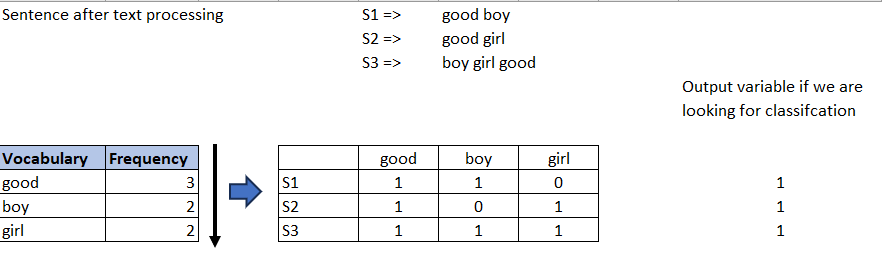

# Bag of Words (BOW)

## Notes

Using BOW we can do sentiments analysis, text classification, etc.  

__Step 1:__  
We have a dataset and in it we have 3 sentences. And output of all these 3 statements are positive.

__Step 2: Text pre-processing:__   
    - Lower case all the Words  
    - Apply stopwords

Why its being done? => to differentiate between words => Boy and boy.   
And using stopwrds He, she, is, and, are => will be gone.

Next we will create the vocabulary and along with it, we will find the frequency of these words in these 3 sentences.

Make sure that the words based on the count are put in descending order. 

So before applying BOW we have seen the vocabulary size and count of words. Also, we need not use some of the words, lets say
in the vocabulary we have words which are present only once (we need not take that) so using BOW we have option to take only those words 
having the most frequency - like top 10 or top 20.

Based on the top most frequencies, I will create vector. As good was present maximum number of times good will come 1st, followed by boy and girl. 

So these are the vectors for the entire 3 sentences.

In OHE, we saw that for every word we are creating a vector. But here we have removed the stopwords. And vector is coming for the entire
sentence.  

Now lets say in S2, good word is repeated twice then usually in the BOW we will increase the count to 2.

Now there are __Binary BOW__ (count will be in binary -> 1 and 0) and __Normal BOW__ (count will be updated based on frequency).

Now in Binary BOW even though the count is 2 in a sentence, Binary BOW will force it to become 1.

## Advantages and Disadvanatges of BOW

### Advantages

1. Simple and intuitive
2. Fixed size input: Based on vocabulary size you are able to convert all the sentences into vectors of same sizes or vocabulary size.

### Disadvanatges

1. Sparse matrix issue is there as every sentence will be converted into vectors of vocabulary size. So sparse matrix/array and will lead to overfitting.
2. Based on the frequency of the word, ordering of the words will change. Because of word ordering change, meaning of the word also chnages because of which some of the semantic information is not getting captured. 
3. Now let's say a word _school_ is there in the test data. But as its not part of the vocabulary created using the training data, the word _school_ will be ignored. This issue is known as __out of vocabulary__.
4. Semantic meaning is still not getting captured. Compared to OHE, small amount of semantic information is getting captured, eg: boy and girl vector. But the most important word or most important context is not getting captured.

On plotting the above 2 vectors, if the angle between them or cosine similarity is very less we can say that both the sentences are almost similar.

So even though the words are totally different, it will be taken up as similar words. So such kind of situations is also not getting handled well with BOW.
So, other techniques such as word2vec will solve these issues.

