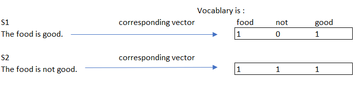
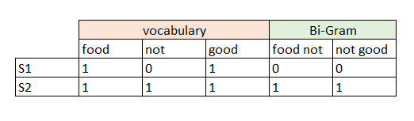
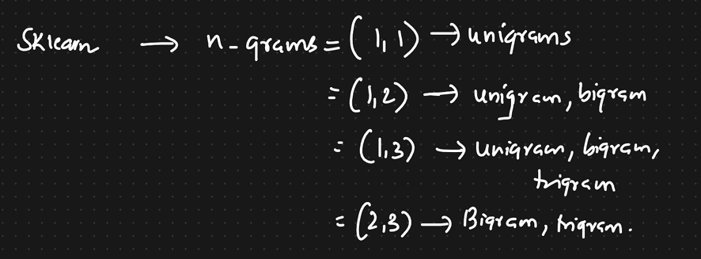

# N-Grams

N-grams of texts are extensively used in text mining and natural language processing tasks. They are basically a set of co-occurring words within a given window and when computing the n-grams you typically move one word forward (although you can move X words forward in more advanced scenarios).

For example, for the sentence “The cow jumps over the moon”. If N=2 (known as bigrams), then the ngrams would be:

- the cow
- cow jumps
- jumps over
- over the
- the moon

So you have 5 n-grams in this case. Notice that we moved from the->cow to cow->jumps to jumps->over, etc, essentially moving one word forward to generate the next bigram.

If N=3, the n-grams would be:

- the cow jumps
- cow jumps over
- jumps over the
- over the moon

So you have 4 n-grams in this case. When N=1, this is referred to as unigrams and this is essentially the individual words in a sentence. When N=2, this is called bigrams and when N=3 this is called trigrams. When N>3 this is usually referred to as four grams or five grams and so on.

## How many N-grams in a sentence?
If X=Num of words in a given sentence K, the number of n-grams for sentence K would be:

$$ N_{grams-K} = X - (N-1) $$

So for the example sentence: _The cow jumps over the moon_:  
$$ X = 5 $$  
$$ N = 2 $$
$$  N_{grams-K} = 5 - (2-1) = 4 $$

The N-gram would be:  
- the cow
- cow jumps
- jumps over
- over the
- the moon

## What are N-grams used for?

N-grams are used for a variety of different task. For example, when developing a language model, n-grams are used to develop not just unigram models but also bigram and trigram models. Google and Microsoft have developed web scale n-gram models that can be used in a variety of tasks such as spelling correction, word breaking and text summarization. 

Another use of n-grams is for developing features for supervised Machine Learning models such as SVMs, MaxEnt models, Naive Bayes, etc. The idea is to use tokens such as bigrams in the feature space instead of just unigrams.

## Python code for N-gram Generation

```
import re

def generate_ngrams(text,n):
    # split sentences into tokens
    tokens=re.split("\\s+",text)
    ngrams=[]
    # collect the n-grams
    for i in range(len(tokens)-n+1):
       temp=[tokens[j] for j in range(i,i+n)]
       ngrams.append(" ".join(temp))

    return ngrams

print(generate_ngrams("The cow jumps over the moon",2))
```

Output:

```
['The cow', 'cow jumps', 'jumps over', 'over the', 'the moon']
```

Another way to do it using NLTK:

```
from nltk import ngrams

sentence = '_start_ this is ngram _generation_'
my_ngrams = ngrams(sentence.split(), 3)
```


Consider these 2 sentences:

S1:  The food is good.

S2: The food is not good.

After removing stopwords the vocabulary will be:



We have not considered __not__ as a stopword of now.

Now in real word, these 2 sentences are completely opposite but on converting these into vectors we can see that these 2 vectors are almost similar with just once change. 

We will try to solve this problem with N-grams.

Now we will take Bi-gram:
- food not
- not good



Now if you compare the 2 vectors above they are not similar and have a huge difference. So we have 3 differences between the vectors of two sentences.

Now the model which we create will be able to clearly distinguish between the 2 sentences because we have usef N-Gram.



So in sklearn, when we use `n_grams(x,y)` it means:
- (1,2) - Combination of unigram and bigram
- (1,3) - Combination of unigram, bigram and trigram.

This can be used when the sentences are different (as in sentence 1 and sentence 2) and you feel that the difference was not captured.


Reference:
1. [What are N-Grams?](https://kavita-ganesan.com/what-are-n-grams/)