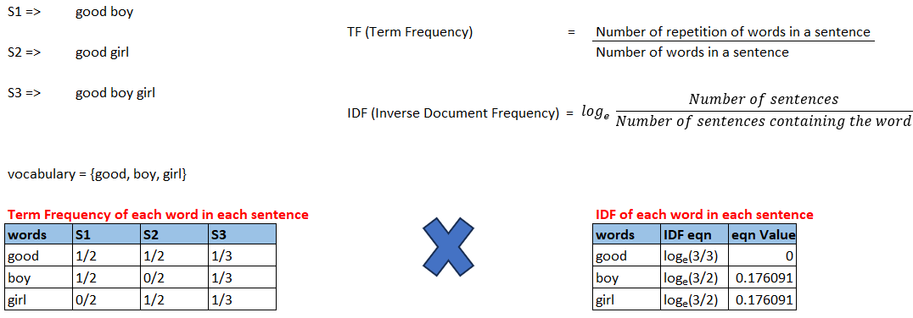
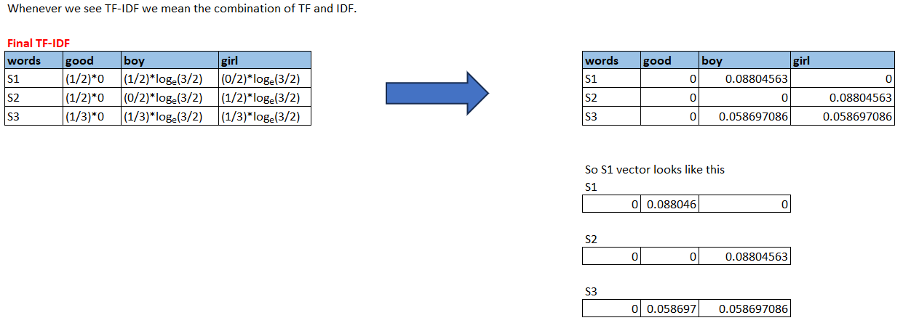
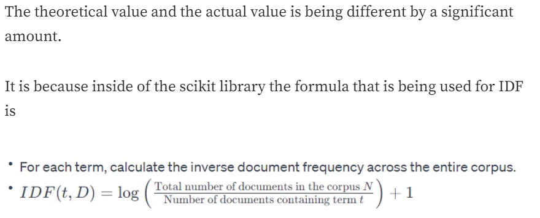

# TF-IDF

Another efficient way of converting words-to-vectors. It is better than BOW.

Taking the same example which we used while studying the bag of words.






By taking inverse document frequency, we can minimize the weighting of frequent terms while making infrequent terms have a higher impact.

## Adv and Disadv of TF-IDF

### Advantages
1. Intuituve and easy to implement
2. Like BOW, inputs are of fixed size.
3. Word importance is getting captured.

    Below lets compare the vectors of TF-IDF and BOW.
    

    In BOW, equal importance was given to the words in sentences (say of S1).  
    In TF-IDF, if a word is present in all sentences it is given a lower importance assuming its not playing an important role. In TF-IDF, we want to give word importance to every sentence. 

    So in words S1 and S2, boy and girl are given high importance respectively.  
     
### Disadvantages
1. Due to high amount of zeros, sparsity (or sparse matrix issue) is still here.
2. Out of vocabulary (OOV) issue

## Code

```
from sklearn.feature_extraction.text import TfidfVectorizer

corpus = ["good boy", "good girl", "good boy girl"]
vectorizer = TfidfVectorizer()
X = vectorizer.fit_transform(corpus)
print(X.toarray())

'''
Output:
[[0.78980693 0.         0.61335554]
 [0.         0.78980693 0.61335554]
 [0.61980538 0.61980538 0.48133417]]

Inside this array of array the first number represents boy, the second number 
represents girl and the third number represents good

The length of the words in the corpus is 3 and they are arranged in ascending 
order
'''
```




#### Reference:
1. [Understanding TF-IDF for Machine Learning](https://www.capitalone.com/tech/machine-learning/understanding-tf-idf/)


