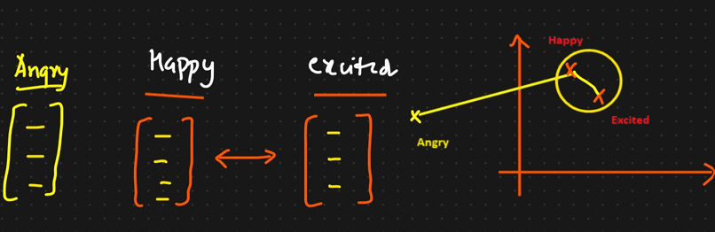

# Word Embeddings

In Natural Language Processing (NLP), word embedding is a term used for the representation of words for text analysis, typically in the form of real valued vector that encodes the meaning of the word such that the words that are closer in the vector space are expected to be similar in meaning.

Consider words __Happy__ and __Excited__.

We can convert these vectors into vectors and 2D graphs using techniques like PCA.  
Happy and Excited will come near each other.  But a 3rd word __Angry__ which is opposite to Happy will be in different quadrant. SO distance between Happy and Excited will be less but distance of these 2 words with Angry will be high.

All these techniques converts words/sentences into vectors.

Word Embeddings are of 2 types:
1. Based on count or frequency
    - One-Hot Encoding
    - Bag of words
    - TF-IDF
2. Deep learning trained models (They give very high accuracy)  
   For working on Word2Vec you need to have knowledge on have ANN works, loss function, etc.
   
   
Types of Word2Vec:  
 - CBOW (Continuous Bag of words)
 - Skipgram

    
Disadvantages due to the word embedding based on count/frequency are resolved by using the Deep Learning trained models.

#### Reference:
1. [Analytics Vidhya: Word Embeddings](https://www.analyticsvidhya.com/blog/2017/06/word-embeddings-count-word2veec/)