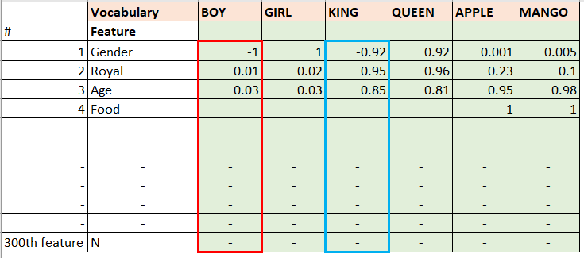
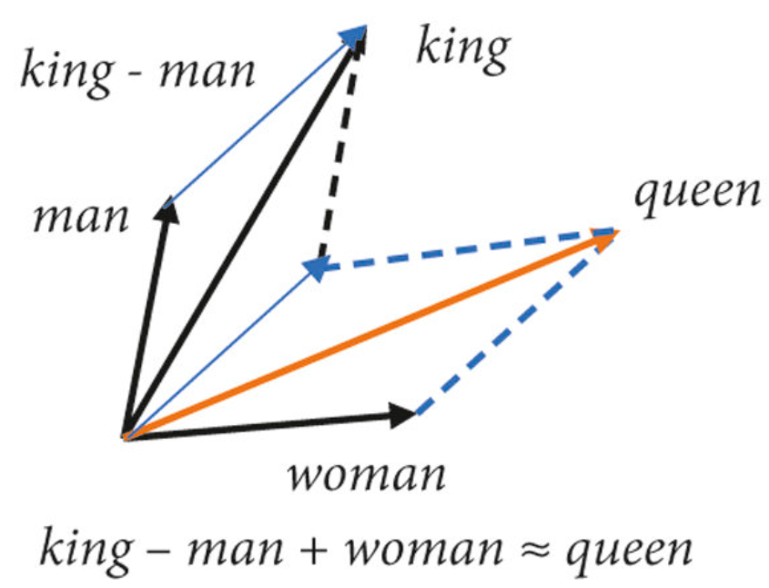
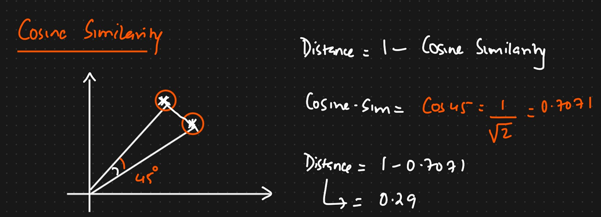
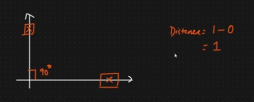
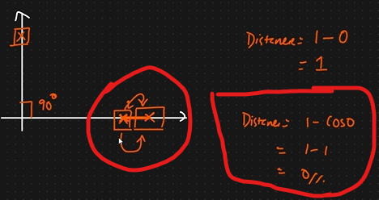
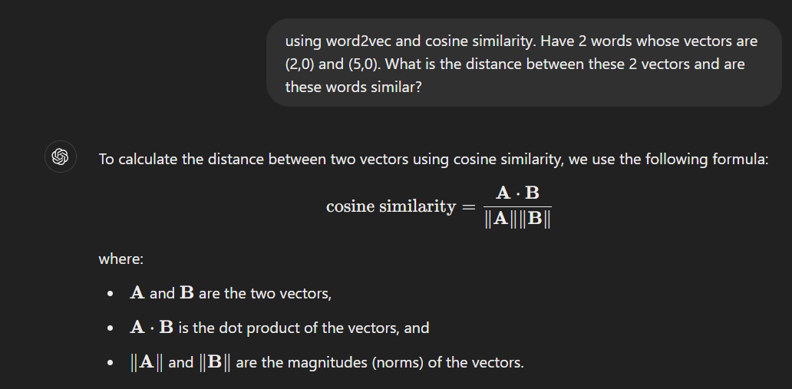
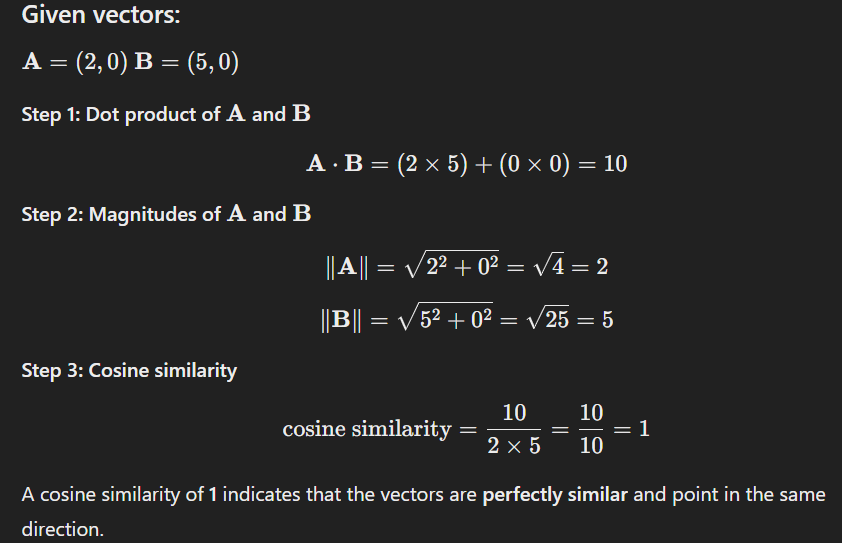

# Word2Vec

Word2Vec technique uses a __neural network model to learn word associations from a large 
corpus of text__. Once trained, such model can detect synonymous words or suggest additional 
words for a partial sequence(eg: google search auto-fill and gmail autofills or meanings of a
word or opposite words). As the name implies, word2vec represents each distinct word with 
a particular list of numbers called vectors.

At the EOD of the day, we are converting word to vector but this vector will be able to detect synonymous words, 
opposite words or fill partial sentence.

In BOW or TF-IDF, based on vocabulary size we are getting 1's or 0's (sparse matrix) or decimals and 0s (similar to sparse matrix).
In Word2Vec it will be different.

Vocabulary => Unique words in corpus(paragraph)

Lets say the vocabulary words are:
BOY     GIRL        KING        QUEEN       APPLE       MANGO

### Feature Representation

Each and every word will be converted to Feature Representation. It means we will convert the words of the vocabulary 
into vectors based on some features.



From these particular features, we are going to assign a numerical value to each word based on the relation of the word with the feature.
So each and every word will be represented by 300 dimension of feature representation. 

__What kind of values we can have in the green section above?__  
Boy and girl are exactly opposite so assign 1 and -1.  
We dont have a sentence or relationship between words like Royal boy so will just assign a value say 0.01.  
Relationship between Age and boy will be less so assign 0.03 (say). Similarly we will fill values based on a model for other features corresponding to Boy and that set of values will be the vector for boy and for king. 

Because of these vectors similar words  will be very close. 

Here we are able to see some features but when we are training a large word2vec model we will not be able to see all these features entirely. Google has come up with a Word2Vec model which trains in 3Billion words coming up from news feed. 

Advantages of word2vec:
1. Suppose if we do this calculation 

    ```
    [KING - MAN + WOMEN] = [QUEEN] 
    ```

    

    The easiest way to think about words and how they can be added and subtracted like vectors is with an example. The most famous is the following: king – man + woman = queen. In other words, adding the vectors associated with the words -king_ and _woman_ while subtracting _man_ is equal to the vector associated with _queen_. This describes a gender relationship.

    __Reference:__ [King – Man + Woman = Queen: The Marvelous Mathematics of Computational Linguistics](https://www.technologyreview.com/2015/09/17/166211/king-man-woman-queen-the-marvelous-mathematics-of-computational-linguistics/)

    Similarly, we can get relations based on vector calculations - like:

    ```
    [KING - BOY + QUEEN] = [GIRL] 
    ```

    __Cosine Similarity:__ To get distance between 2 vectors. Formula is : 
    $$ Distance = 1 - CosineSimilarity $$

    

    Now in case of vectors like this:

    

    We can say that the vectors are completely different as its difference is 1 (maximum). If distance becomes nearer to zero we can
    say these 2 vectors or words are similar.

    

    Now above 2 vectors (highlighted in red) can be same as the angle between them is zero.

    __DOUBT__ isnt the angle 180. And so the distance will be: 
    $$ cos(180)=-1 => Distance = 1 - cos(180) = 1-(-1) = 2$$
    
    __Clarification done using CHATGPT:__
    

    

    The distance between the vectors is 0 (because cosine similarity = 1) and these two words are considered very similar according to the cosine similarity measure.


