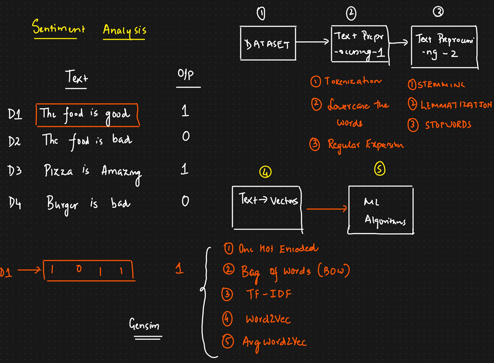

# What next?

We will see where the things we learnt fixes into the lifecycle of the NLP project.

__Why we do lower-case of words?:__ To distinguish between words - _The_ and _the_.

Once text pre-processing is done we go for converting the text into vectors. __Vector__ is numerical representation of a specific text - it can be word or sentence.

We try to represent each and every word with a specific text which gives a meaningful representation of the specific word so that we can apply any kind of ML algorithm (eg: classification) on it.  

OHE is not a very good method for text to vector conversion. We have improved techniques such as Bag of words(BOW), TF-IDF, word2vec and average word2vec. 

We can take vectors obtained above and use it to train ML models for prediction. 

__Gensim__ library can help us with word2vec i.e., vector creation.